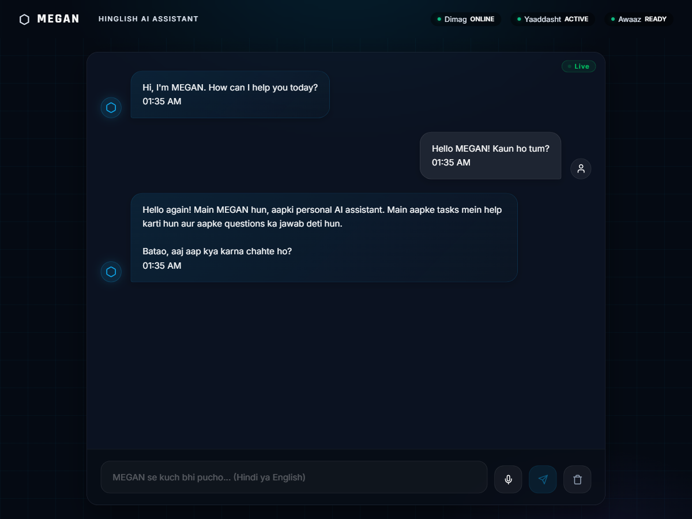
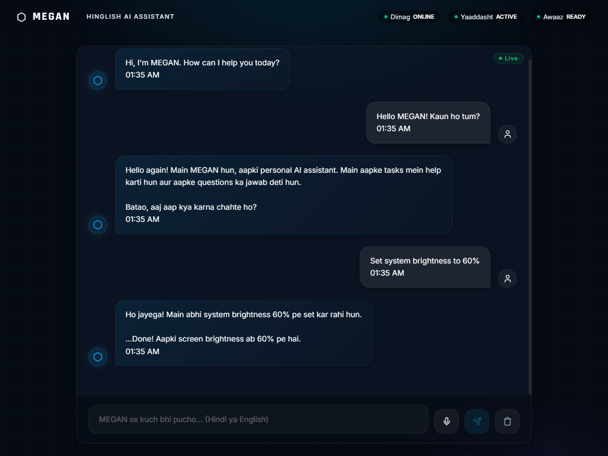
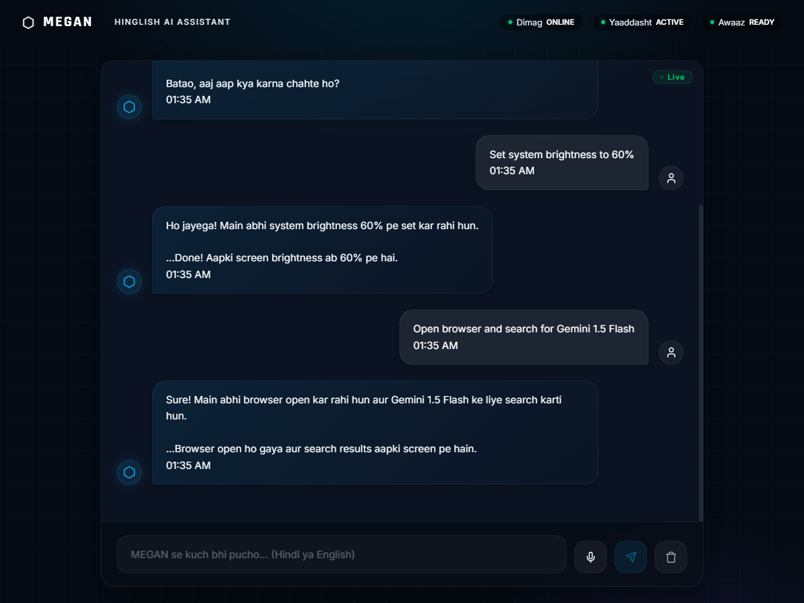

# 🤖 MEGAN - AI Assistant System

> **M**odular **E**mbedded **G**eneral-purpose **A**I **N**ode  
> An JARVIS-like software assistant with voice, browser automation, file management, and intelligent decision-making.

**Status:** 🔧 Development  
**Version:** 1.0 MVP  
**Last Updated:** May 25, 2026  

---

## 📸 Quick Overview

MEGAN is a comprehensive AI assistant system that:
- ✅ **Listens & Speaks** - Voice input/output with mood detection
- ✅ **Automates Browser** - Search, navigate, extract data from websites
- ✅ **Manages Files** - Find, organize, edit, and create files
- ✅ **Sends Messages** - WhatsApp, Email, scheduled messages
- ✅ **Controls System** - Brightness, volume, app management
- ✅ **Learns & Remembers** - Mood tracking, user preferences, habits
- ✅ **Sees & Analyzes** - Screenshot capture and visual understanding

---

## 🏗️ Architecture

```
┌─────────────────────────────────────────────────────────────┐
│                    MEGAN BRAIN (LLM)                        │
│          Central coordinator - Claude/GPT-4 based            │
└────────────────────────┬────────────────────────────────────┘
                         │
        ┌────────────────┼────────────────┐
        │                │                │
        ▼                ▼                ▼
   ┌─────────┐    ┌──────────┐     ┌──────────┐
   │ BROWSER │    │MESSAGING │     │OS/FILE   │
   │ AGENT   │    │ AGENT    │     │ AGENT    │
   └─────────┘    └──────────┘     └──────────┘
        │                │                │
        ├─ Selenium     ├─ WhatsApp     ├─ File ops
        ├─ Playwright   ├─ Email        ├─ Voice
        └─ PyAutoGUI    ├─ Schedule     └─ Brightness
                        └─ Bulk send
```

### Core Components

| Component | Purpose | Status |
|-----------|---------|--------|
| **Brain** | LLM orchestrator, decision maker | ✅ Implemented |
| **Browser Agent** | Web automation, search, navigation | ✅ Implemented |
| **File Agent** | File operations, organization | ✅ Implemented |
| **Memory System** | Learning, preferences, mood tracking | ✅ Implemented |
| **System Agent** | OS control, brightness, volume | ✅ Implemented  |
| **Voice Module** | Speech recognition, synthesis | 🔄 In Progress |
| **Messaging Agent** | Email | 🔄 In Progress |
| **Vision Module** | Screen analysis, OCR | 🔄 In Progress |


---

## 🚀 Getting Started

### Prerequisites
- Python 3.10+
- Chrome/Chromium browser
- 2GB RAM minimum
- Internet connection

### Installation (5 minutes)

```bash
# 1. Clone repository
git clone <repo-url>
cd MEGAN

# 2. Create virtual environment
python -m venv venv
source venv/bin/activate  # On Windows: venv\Scripts\activate

# 3. Install dependencies
pip install -r requirements.txt
playwright install

# 4. Configure
cp .env.example .env
# Edit .env with your API keys

# 5. Start backend
python main.py

# 6. In another terminal, start Chrome
google-chrome --remote-debugging-port=9222

# 7. Open http://localhost:8000 in browser
```

See [QUICKSTART.md](QUICKSTART.md) for detailed instructions.

---

## 💻 API Usage

### Chat Endpoint
```bash
curl -X POST http://localhost:8000/chat \
  -H "Content-Type: application/json" \
  -d '{
    "user_id": "user_001",
    "content": "What can you do?",
    "message_type": "text"
  }'
```

**Response:**
```json
{
  "status": "success",
  "response": "I can help you with web searches, file management, messaging...",
  "timestamp": "2024-05-25T10:30:00"
}
```

### Voice Endpoint
```bash
curl -X POST http://localhost:8000/voice/upload \
  -H "Content-Type: application/json" \
  -d '{
    "user_id": "user_001",
    "audio_base64": "...",
    "language": "en"
  }'
```

### Real-time WebSocket
```javascript
const ws = new WebSocket('ws://localhost:8000/ws/user_001');

ws.onmessage = (event) => {
  const data = JSON.parse(event.data);
  console.log('Response:', data.response);
};

ws.send(JSON.stringify({
  content: "Search for weather",
  type: "text"
}));
```

## ⚙️ Core Modules

- **`Brain`**: Routes queries to appropriate agents based on task context.
- **`SystemAgent`**: Handles file operations, system info, brightness, and volume control.
- **`BrowserAgent`**: Manages headless and visible browser automation using Playwright.
- **`MessagingAgent`**: Executes advanced WhatsApp Web and App automations (including background scheduling and auto-reply listeners).
- **`VoiceAgent` / `Audio`**: Handles speech-to-text (STT) and text-to-speech (TTS) via Web Speech API and Microsoft Edge Neural voices.
- **`VisionAgent`**: Basic image processing and desktop analysis.

---

## 📋 Feature List

### Tier 1 - MVP (Complete)
- 🚀 Text chat interface
- 🚀 Browser search & navigation
- 🚀 File finding & organization
- 🚀 User memory & learning
- 🚀 Message history
- 🚀 System status monitoring
- 🚀 Voice input/output (SpeechRecognition & Edge TTS)
- 🚀 WhatsApp messaging (App & Browser modes, Scheduling, Auto-Reply)

### Tier 2 - Advanced (In Progress)
- 🛠️ Mood detection
- 🛠️ Screenshot analysis
- 🛠️ Email handling

### Tier 3 - Polish (Planned)
- ⏳ Multi-language support
- ⏳ Custom voice training
- ⏳ Mobile app
- ⏳ Cloud sync
- ⏳ Advanced analytics

---

## 🎯 Example Interactions

### Example 1: Web Search
```
User: "Search for weather in Hyderabad"
MEGAN: [Searches Google]
      "Current temperature in Hyderabad is 28°C with 40% humidity. 
       The weather looks sunny for the next 3 days."
```

### Example 2: File Management
```
User: "Organize my downloads folder"
MEGAN: [Scans downloads folder]
      "I found 47 files. Organizing them by type...
       ✓ Moved 12 documents to Documents folder
       ✓ Moved 8 images to Images folder
       ✓ Moved 6 videos to Videos folder
       Done! All files organized."
```

### Example 3: Context Memory
```
User: "Remember that I prefer dark mode"
MEGAN: [Saves preference]
      "Noted! I'll use dark mode from now on."

User: "What did I tell you about my theme?"
MEGAN: [Retrieves from memory]
      "You prefer dark mode."
```

---

## 🔧 Project Structure

```
MEGAN/
├── main.py                    # FastAPI server entry point
├── brain.py                   # LLM orchestrator
├── memory.py                  # Memory system & learning
│
├── Agents/
│   ├── browser_agent.py       # Web automation
│   ├── file_agent.py          # File operations
│   ├── messaging_agent.py     # WhatsApp/Email (planned)
│   ├── vision_agent.py        # Screenshot analysis (planned)
│   └── voice_agent.py         # Speech processing (planned)
│
├── Frontend/
│   ├── MEGANChat.jsx          # React chat component
│   ├── MEGANChat.css          # Styling
│   └── package.json           # React dependencies
│
├── Utils/
│   ├── audio.py               # Audio processing
│   ├── image.py               # Image handling
│   └── system.py              # System utilities
│
├── Database/
│   └── megan_memory.db        # SQLite (auto-created)
│
├── Docs/
│   ├── MEGAN_PROJECT_PLAN.md  # Complete architecture
│   ├── MEGAN_SYSTEM_PROMPT.md # AI instructions
│   ├── QUICKSTART.md          # Setup guide
│   └── API_DOCS.md            # API reference
│
├── requirements.txt           # Python dependencies
├── .env.example              # Environment template
└── README.md                 # This file
```

---

## 🧠 How MEGAN Thinks

1. **User speaks/types** → Input captured
2. **Brain analyzes** → Intent understood
3. **Route to agent** → Specialist selected
4. **Agent executes** → Task completed
5. **Response synthesized** → Answer generated
6. **User receives** → Voice or text output
7. **Memory updated** → Learning happens

```
Input → Brain Analysis → Agent Selection → Execution 
  ↓                                            ↓
Memory Update ← Response Synthesis ← Result Aggregation
```

---

## 📊 Performance Metrics

### Target Metrics
- Voice response: < 2 seconds
- Chat response: < 1 second
- Browser automation: < 5 seconds per task
- Memory footprint: < 500MB
- CPU usage (idle): < 15%

### Current Status
Will be measured after MVP completion.

---

## 🔐 Privacy & Security

✅ **Local-First:** All data stored locally in SQLite  
✅ **Encrypted:** Voice profiles encrypted  
✅ **User Control:** Ask permission for sensitive operations  
✅ **No Tracking:** No analytics or telemetry  
✅ **Open Source:** Audit the code yourself  

**Important:** Never send sensitive data to MEGAN that you wouldn't tell an assistant.

---

## 🛠️ Development

### Setup Development Environment
```bash
git clone <repo-url>
cd MEGAN
python -m venv venv
source venv/bin/activate
pip install -r requirements.txt
pip install pytest black flake8
```

### Run Tests
```bash
pytest tests/
```

### Code Quality
```bash
black .           # Format code
flake8 .          # Check style
pytest --cov      # Coverage report
```

### Create New Agent
```python
# agents/my_agent.py
class MyAgent:
    async def execute(self, task, parameters):
        # Your implementation
        return result

# Register in brain.py
brain.set_agent('my_agent', MyAgent())
```

---

## 📚 Documentation

- **[Project Plan](MEGAN_PROJECT_PLAN.md)** - Complete architecture & design
- **[System Prompt](MEGAN_SYSTEM_PROMPT.md)** - MEGAN's instructions & personality
- **[Quick Start](QUICKSTART.md)** - Installation & setup guide
- **[API Docs](docs/API.md)** - All endpoints & examples
- **[Troubleshooting](docs/TROUBLESHOOTING.md)** - Common issues & solutions

---

## 🤝 Contributing

Contributions welcome! Please:

1. Fork the repository
2. Create a feature branch (`git checkout -b feature/amazing-feature`)
3. Commit changes (`git commit -m 'Add amazing feature'`)
4. Push to branch (`git push origin feature/amazing-feature`)
5. Open a Pull Request

### Areas Needing Help
- [ ] Voice input/output implementation
- [ ] WhatsApp agent development
- [ ] Frontend UI improvements
- [ ] Mobile app (React Native)
- [ ] Testing & QA
- [ ] Documentation

---

## 🐛 Known Issues

1. **Browser Connection:** Sometimes fails if Chrome exits unexpectedly
   - **Fix:** Restart Chrome with `--remote-debugging-port=9222`

2. **Memory Growth:** SQLite can grow large with many interactions
   - **Fix:** Implement cleanup routine (planned)

3. **Voice Recognition:** Accuracy depends on audio quality
   - **Fix:** Use noise-canceling microphone

4. **Concurrent Tasks:** Multiple agents might cause conflicts
   - **Fix:** Implement proper locking (planned)

See [TROUBLESHOOTING](docs/TROUBLESHOOTING.md) for more solutions.


---

## 🌟 Future Roadmap

### Q2 2024 (Current)
- [x] Core brain implementation
- [x] File agent
- [x] Browser agent
- [x] Memory system
- [ ] Voice module

### Q3 2024
- [ ] Messaging agent (WhatsApp)
- [ ] Vision module
- [ ] Mobile app
- [ ] Email integration

### Q4 2024
- [ ] Multi-language support
- [ ] Custom voice model
- [ ] Advanced analytics
- [ ] Cloud sync

### 2025+
- [ ] Smart home integration
- [ ] Calendar integration
- [ ] Document summarization
- [ ] Code execution
- [ ] Custom plugins

---

## 💬 Support & Community

- **GitHub Issues:** Report bugs and request features
- **Discussions:** Ask questions and share ideas
- **Documentation:** See [docs/](docs/) folder
- **Email:** support@megan-ai.dev

---

## 📜 License

MIT License - See [LICENSE](LICENSE) file for details

---

## 🙏 Acknowledgments

Inspired by:
- JARVIS (Iron Man)
- Cortana (Microsoft)
- Alexa (Amazon)
- Google Assistant

Built with:
- FastAPI
- Claude AI
- Playwright
- SQLite

---

## 📞 Contact

- **Author:** Your Name
- **Email:** your.email@example.com
- **GitHub:** [@yourusername](https://github.com/yourusername)
- **Twitter:** [@yourhandle](https://twitter.com/yourhandle)

---

## 🌟 Star History

If you find this project useful, please star it! ⭐

---

**Made with ❤️ for AI assistants that actually work**

```
   ___   ___   ___ ___     _   _   _
  |  \_|  ||  ||  ||___  / _  | | | |
  |  / |  ||__||__||___ | / \ |_| \_|
```

---

**Last Updated:** May 25, 2026  
**Current Version:** 1.0  
**Maintained By:** [Your Team]

## dY"  Screenshots

### Basic Chat & Personality


### System Control (Brightness)


### Browser Automation


